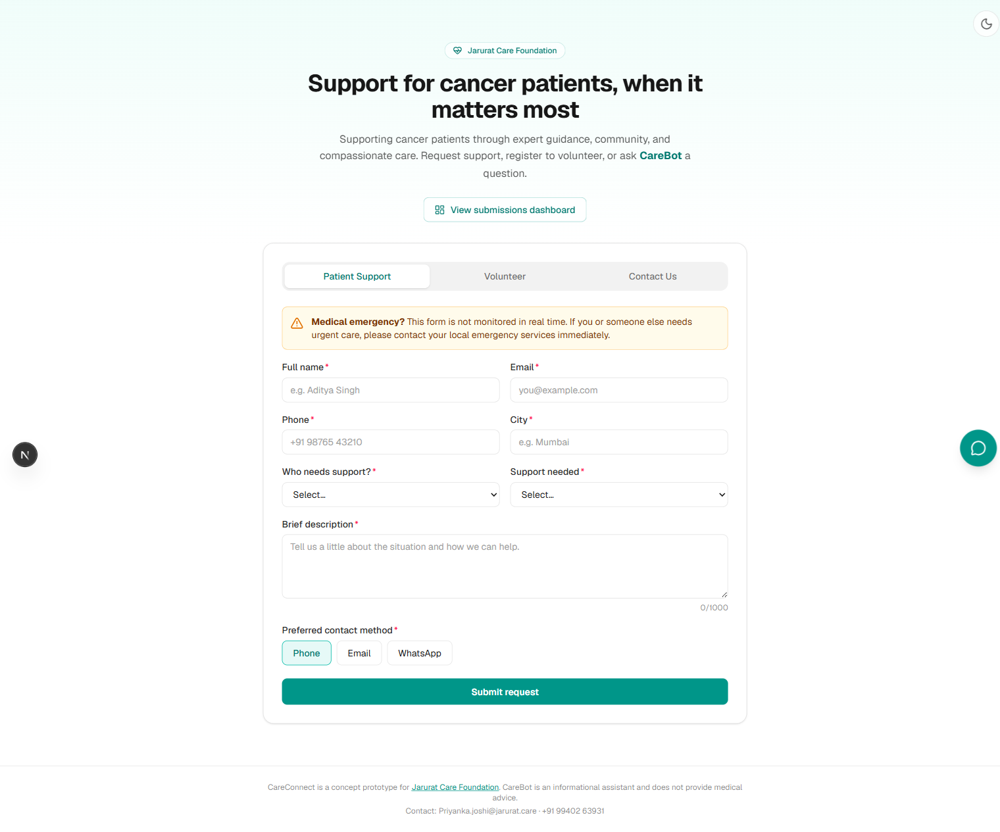
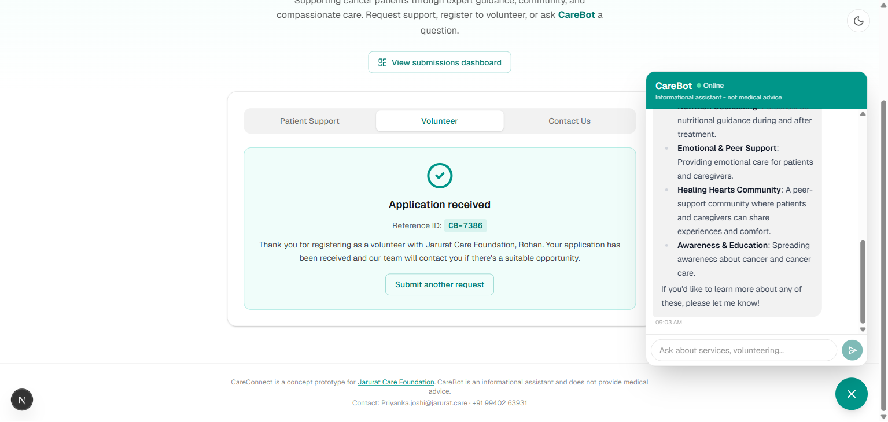
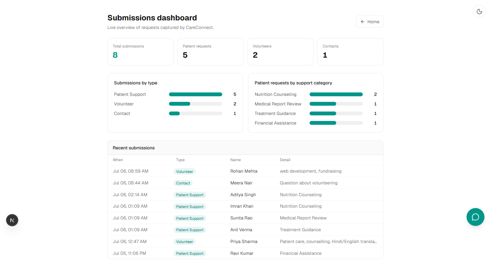

# CareConnect - Jarurat Care Foundation Support Portal

A concept-level healthcare support web app for [Jarurat Care Foundation](https://www.jarurat.care), a Mumbai NGO supporting cancer patients and their caregivers. It provides patient support, volunteer and contact forms with instant auto-responses, and CareBot - an AI FAQ assistant powered by Google Gemini, grounded in the NGO's real information and guarded against giving medical advice.

Built as an assignment prototype, so it favours a clean, realistic architecture over feature count.

### [Watch the demo video](https://youtu.be/iYNgzbxONQ0)

**Live Website:** [careconnect-jc.vercel.app](https://careconnect-jc.vercel.app)

**Submissions dashboard:** the same site at **`/dashboard`** (public, demo data) - stat tiles, charts, and the recent submissions captured by the forms.

## Features

- **Patient Support form** - name, email, phone, city, patient type, support needed (tuned to Jarurat's services), description with a live character counter, and preferred contact method. Client and server validation, an emergency banner, and an auto-response with a reference ID (e.g. `CB-1042`).
- **CareBot, the AI FAQ assistant** - a floating chat widget on every page. Answers questions about services, volunteering, donations, medical report review, and contact. Powered by Gemini Flash, grounded on a knowledge base, and clearly labelled informational, not medical advice.
- **Volunteer and Contact forms** - same validated pattern and API.
- **Submissions dashboard** (`/dashboard`) - stat tiles, bar charts of requests by type and support category, and a recent-submissions table. Unauthenticated (demo only, see limitations).

## Tech stack

| Layer | Choice |
|------|--------|
| Framework | Next.js 16 (App Router) + React 19 + TypeScript |
| Styling | Tailwind CSS v4 + `@tailwindcss/typography` |
| Forms | react-hook-form + zod (shared schema, client and server) |
| AI | Google Gemini via `@google/genai` (`gemini-2.5-flash`) |
| Data | Supabase (Postgres) via `@supabase/supabase-js` |
| Icons / Markdown | `lucide-react`, `react-markdown` |
| Hosting | Vercel |

## Architecture

Everything sensitive runs server-side in Next.js Route Handlers, so the browser never sees the Gemini or Supabase keys.

```
 Browser (client components)
 ┌───────────────────────────────────────────┐
 │  Patient / Volunteer / Contact forms       │
 │  CareBot chat widget                       │
 └───────────────┬───────────────┬───────────┘
                 │               │
        POST /api/submit   POST /api/chat
                 │               │
 Next.js Route Handlers (server-only)
 ┌───────────────▼───┐   ┌───────▼─────────────────────────┐
 │ honeypot check    │   │ IP rate-limit                   │
 │ zod re-validation │   │ medical-safety guard            │
 │ Supabase INSERT   │   │ Gemini (grounded on knowledge)  │
 └───────────────┬───┘   └───────┬─────────────────────────┘
                 │               │
            Supabase DB      Gemini Flash
```

## The AI idea and NGO use-case

Jarurat Care already runs an AI assistant ("HOPE"), so an FAQ chatbot fits naturally. CareBot lets a patient or caregiver get instant, reliable answers without waiting for staff, which cuts the NGO's repetitive-question load while keeping people safe:

- **Grounded:** answers only from `content/knowledge.md` (real services, contact, response times). The system prompt tells it to never claim a service that isn't in the knowledge base and to defer to the team when unsure.
- **Safe:** a code-level medical-intent guard (`src/server/medicalGuard.ts`) short-circuits advice-seeking and clinical questions ("which chemo should I take?", symptoms, doses) with a safe referral before ever calling the model. It deliberately does not trip on admin phrases like "medical report review".
- The Patient Support form and auto-response are the automation piece: submissions are captured centrally with a reference ID and an expected 24-48h response.

## Run locally

```bash
npm install
cp .env.example .env.local   # then fill in the three values
npm run dev                  # http://localhost:3000
```

### Environment variables (all server-side, no `NEXT_PUBLIC_`)

```
GEMINI_API_KEY=     # free key from https://aistudio.google.com/apikey
SUPABASE_URL=       # Supabase, Project Settings > API
SUPABASE_ANON_KEY=  # Supabase, Project Settings > API (anon/public key)
```

### Supabase setup (SQL)

Create a project, then run this in the SQL editor:

```sql
create table if not exists submissions (
  id uuid primary key default gen_random_uuid(),
  kind text not null,
  name text,
  email text,
  phone text,
  payload jsonb,
  created_at timestamptz not null default now()
);

alter table submissions enable row level security;

-- Base table privileges for the anon role (needed because we did NOT enable
-- "Automatically expose new tables" when creating the project).
grant insert, select on table public.submissions to anon;

-- Anon may INSERT (forms, via the server route) and SELECT (the demo /dashboard).
-- Both happen server-side; the anon key never reaches the browser. In production the
-- dashboard would be auth-gated and this SELECT policy removed.
create policy "anon can insert" on submissions
  for insert to anon with check (true);

create policy "anon can read" on submissions
  for select to anon using (true);
```

## Deploy to Vercel

1. Push this repo to GitHub.
2. Import it on [Vercel](https://vercel.com/new) (Next.js is auto-detected).
3. Add the three environment variables (same as `.env.local`).
4. Deploy. You get a live URL. Test that `/api/chat` responds and a form submission lands in Supabase.

## Screenshots

| Home + Patient Support form | CareBot (grounded AI answer) |
|---|---|
|  |  |



More screenshots of every view - the volunteer and contact forms, the auto-response, the CareBot medical-safety guard, and all screens in both light and dark themes - are in the [`screenshots/`](screenshots) folder.

## Prototype limitations

- No authentication, including the `/dashboard`, which is public for this demo (uses fake data). In production it would be auth-gated and would show aggregates rather than raw contact details.
- A single `submissions` table (fine for a concept).
- CareBot is informational only, not medical advice.
- Rate limiting is demo-only (in-memory, per serverless instance).
- The PDF upload and staff dashboard from early ideas were cut to keep scope tight.

## Future improvements

- Auth-gated staff dashboard to triage submissions.
- Durable rate limiting (Upstash / Vercel KV) and service-role/Edge-Function inserts.
- Appointment booking, PDF medical-report summarization, and RAG over the NGO's real content.

---

_Not affiliated with or endorsed by Jarurat Care Foundation; built as an educational prototype using their public information._
